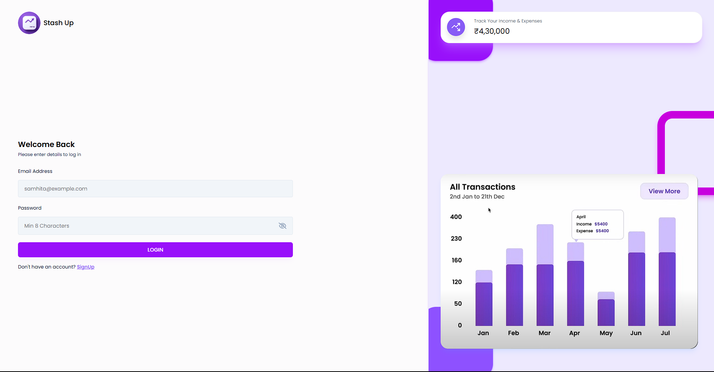
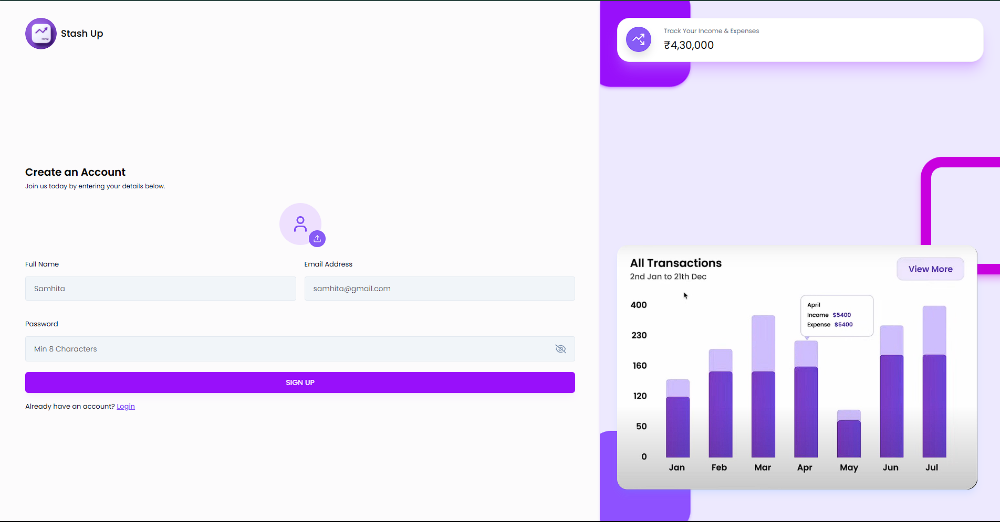
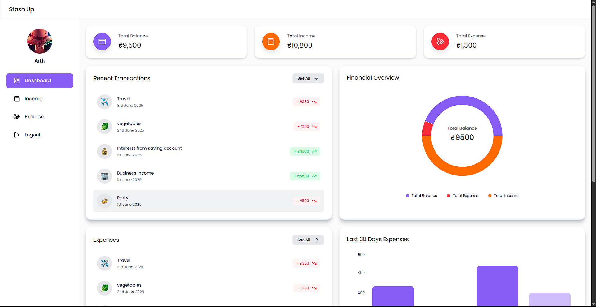
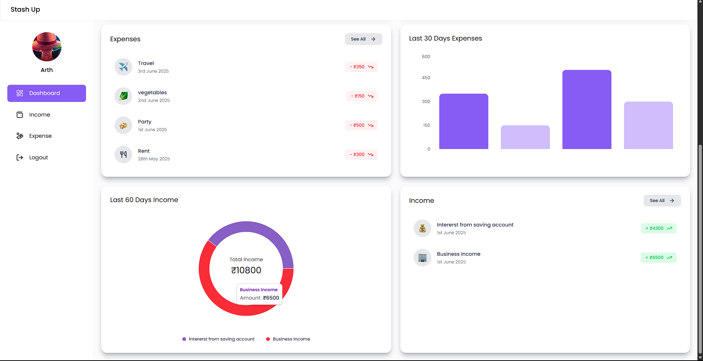
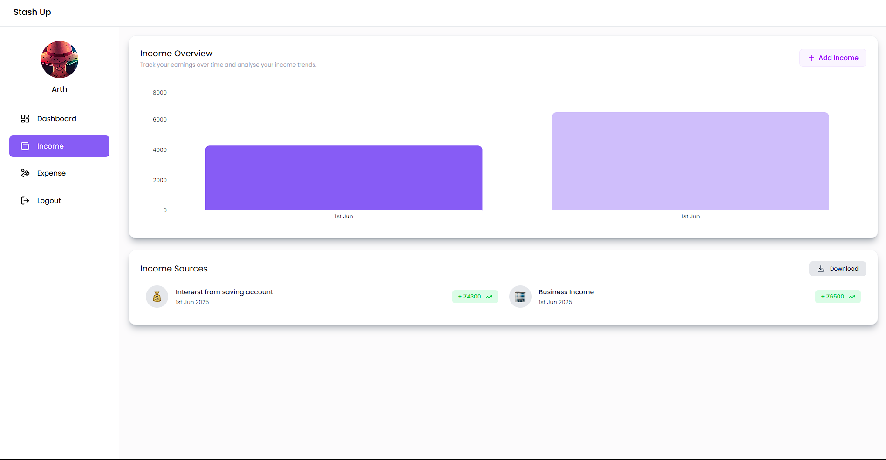
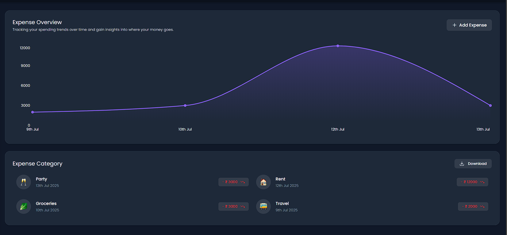

# 💰 StashUp (Expense Tracker)

A full-stack Expense Tracker web application that allows users to add, track, and manage their daily expenses and incomes with ease.


## 📌 Features

- 🔐 User Authentication (Signup & Login)
- ➕ Add income and expense transactions
- 📊 View total balance, income, and expense
- 📅 Track transactions by date
- 🧾 Delete transactions
- 📈 Dashboard with overview and transaction history
- 🎨 Clean, responsive UI with modern design


## 🛠️ Tech Stack

### 🔹 Frontend
- React.js  
- Tailwind CSS *(or your styling choice)*  
- Axios *(for API calls)*

### 🔹 Backend
- Node.js  
- Express.js  
- MongoDB + Mongoose *(for data storage)*  
- JWT *(for authentication)*

## 📁 Project Structure
```
expense-tracker/
├── frontend/               # React frontend
│   ├── public/
│   ├── src/
│   │   ├── components/     # Reusable UI components (Navbar, Forms, etc.)
│   │   ├── pages/          # Page components (Dashboard, Login, etc.)
│   │   ├── services/       # API calls using Axios
│   │   ├── context/        # Global state (optional)
│   │   └── App.js
│   └── package.json

├── backend/                # Node.js + Express backend
│   ├── controllers/        # Request handling logic
│   ├── models/             # Mongoose data models
│   ├── routes/             # Express route definitions
│   ├── middleware/         # Auth and other middleware
│   ├── config/             # DB config, environment setup
│   ├── .env                # Environment variables
│   └── server.js           # Entry point

├── README.md
└── .gitignore
```

## 🚀 Live Demo

Check out the live version here:  
👉 [Stash Up](https://stashup.vercel.app/login)

> ⚠️ **Note:** The backend is hosted on Render's free tier.  
> It may take **20–30 seconds to wake up** if it's been idle — please be patient!


## 🖼️ Screenshots

### 🔹 Login Page


### 🔹 Sign Up Page


### 🔹 Dashboard




### 🔹 Income Page


### 🔹 Expense Page



 


